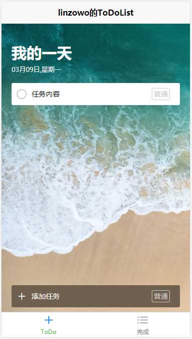

# uniapp-todolist

uniapp框架开发一次多平台支持，这种诱惑又怎么抵挡得了呢。

[查看demo](https://linzowo.gitee.io/uniapp/todolist/)

## 说明

基于uniapp的一个练习项目，旨在通过它熟悉uniapp的开发过程及相关语法等。如果你也想通过这个项目上手，欢迎往下看。

## 项目架构

基础架构采用的`uni-app`开发工具`HBuilderX`新建项目中的`uni-app默认模板`

## 项目基本页面

+ 主界面

  

+ 已完成界面

  

## 项目功能

### tabBar

- [x] 底部tabbar切换页面

### 顶部标题

- [x] 顶部标题日期随系统时间变化,格式固定

### 任务列表

- [x] 任务列表根据vuex中的数据动态渲染
- [x] 任务列表每一项的等级可以通过右侧按钮改变
- [x] 任务等级改变后按钮样式随任务等级变化
- [x] 左侧按钮点击后修改任务状态为完成
- [x] 完成任务自动渲染至完成页面

### 添加任务

- [x] 右侧任务按钮可以更改新增任务等级
- [x] 任务等级改变后任务等级按钮样式也跟随变化
- [x] 左侧加号按钮点击时样式发生变化,点击完成后恢复
- [x] 移动端用户输入时防止tabBar被软键盘顶起
- [x] 点击添加按钮后判断用户是否输入新任务,输入了就向后台写入新任务

### 完成页面

- [x] 根据vuex中数据动态渲染已完成数据
- [x] 点击任务左侧按钮取消任务完成状态,任务自动回到待完成页面
- [x] 右侧按钮删除任务,点击后任务所有信息删除

